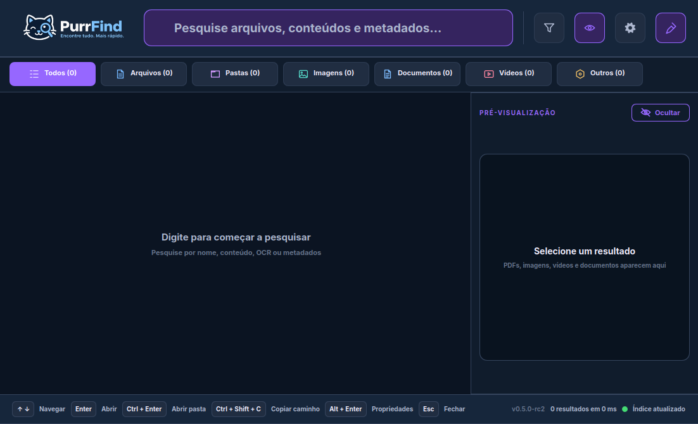
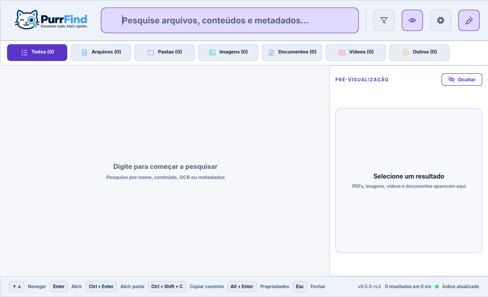
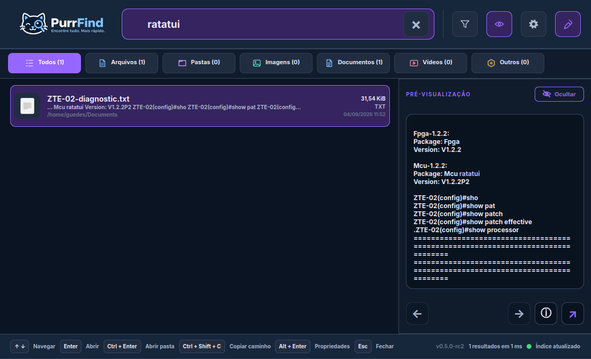
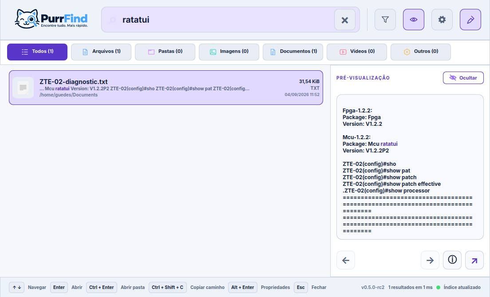

<div align="center">


**Fast, private and native file search for Linux**

[](https://github.com/guedessoftware/puurfind/actions/workflows/ci.yml)
[](https://github.com/guedessoftware/puurfind/releases)
[](LICENSE)

[Português (Brasil)](README.pt-BR.md)

</div>

PurrFind builds a private local index and finds files, folders, metadata and
document content as you type. It is written in C++20/Qt 6, works on X11 and
Wayland, and never requires an account, telemetry or a network connection.

## See it in action

The interface has a focused dark theme and a complete light theme. Search
results are grouped by category and the preview panel opens supported content
without leaving the application.

<p align="center">
  
  
</p>
<p align="center">
  
  
</p>

## Features

- Instant filename and path search backed by SQLite FTS5 trigram indexes.
- Full-text search with snippets, phrases, scoped fields and category filters.
- Persistent, low-priority indexing with inotify updates and crash recovery.
- Local OCR for scanned and hybrid PDFs; optional OCR for PNG, JPEG, TIFF and WebP.
- Previews for images, PDFs, text, Markdown, Office/ODF documents, folders and
  local MP4/WebM video playback.
- Folder previews show the immediate contents with type-specific icons.
- EXIF metadata search (camera, dimensions and author) when Exiv2 is available.
- System tray status, open/quit actions and the global `Super+F` shortcut.
- Light, dark and system themes, configurable from Settings.
- Optional usage-aware ranking, resource limits and independent OCR/content
  indexing controls.
- Local-only by design: no cloud account, telemetry, upload or background network call.

## Download the beta

The current public beta is **0.5.0-rc2**. Packages and the source archive are
attached to the [GitHub release](https://github.com/guedessoftware/puurfind/releases/tag/v0.5.0-rc2).

| Platform | Download | Install example |
| --- | --- | --- |
| Debian/Ubuntu | [`.deb`](https://github.com/guedessoftware/puurfind/releases/download/v0.5.0-rc2/purrfind-0.5.0-rc2-x86_64.deb) | `sudo apt install ./purrfind-0.5.0-rc2-x86_64.deb` |
| Fedora/RHEL | [`.rpm`](https://github.com/guedessoftware/puurfind/releases/download/v0.5.0-rc2/purrfind-0.5.0-rc2-x86_64.rpm) | `sudo dnf install ./purrfind-0.5.0-rc2-x86_64.rpm` |
| Arch Linux | [`.pkg.tar.zst`](https://github.com/guedessoftware/puurfind/releases/download/v0.5.0-rc2/purrfind-0.5.0rc2-25-x86_64.pkg.tar.zst) | `sudo pacman -U purrfind-0.5.0rc2-25-x86_64.pkg.tar.zst` |
| Source | [`tar.xz`](https://github.com/guedessoftware/puurfind/releases/download/v0.5.0-rc2/PurrFind-0.5.0-rc2-source.tar.xz) | See [Build](#build-from-source) |

Verify downloads with [`SHA256SUMS`](https://github.com/guedessoftware/puurfind/releases/download/v0.5.0-rc2/SHA256SUMS).

For Debian/Ubuntu, prefer `apt install ./purrfind-*.deb`: it installs the Qt,
QML and multimedia runtime dependencies automatically. If the package was
installed previously with `dpkg -i`, repair dependencies with `sudo apt -f install`.

> Flatpak is not included in this beta. PurrFind's persistent user indexer and
> explicit filesystem roots need a portal/sandbox design that preserves the
> same functionality without over-broad permissions.

## Search syntax

Search terms match names and indexed content. Fields can be combined:

```text
contract type:pdf
content:"neutral network" path:Documents
camera:Canon width:>3000 type:image
pages:>20 author:João
source:ocr FIRENETWORK
modified:7d size:>10MB
```

Use `kind:file` and `kind:folder`, or click the category tabs. The default
roots and excluded folders are editable in Settings; hidden files remain
searchable unless excluded explicitly.

## Build from source

Requirements: C++20, CMake 3.24+, Ninja, Qt 6.4+ (Core, DBus, Gui,
Multimedia, Qml, Quick and Quick Controls), SQLite with FTS5, Poppler-Qt6,
libzip, libxml2, Exiv2, Tesseract/Leptonica and installed Tesseract language
data. Optional families can be disabled with
`-DPURRFIND_WITH_PDF=OFF`, `-DPURRFIND_WITH_OFFICE=OFF`,
`-DPURRFIND_WITH_EXIV2=OFF` or `-DPURRFIND_WITH_OCR=OFF`.

```sh
cmake -S . -B build -G Ninja -DCMAKE_BUILD_TYPE=Release
cmake --build build
ctest --test-dir build --output-on-failure
./build/purrfind
```

Install and activate the per-user indexer:

```sh
cmake --install build
systemctl --user daemon-reload
systemctl --user enable --now purrfind-indexer.service
```

The tray/shortcut listener is registered through XDG autostart and starts at
the next graphical login. To activate it immediately after installation,
launch it in the background from your user session:
`nohup /usr/bin/purrfind --background >/tmp/purrfind.log 2>&1 & disown`.
The process remains resident in the tray so the global shortcut stays active.

## Keyboard and tray controls

`Super+F` opens or focuses PurrFind. Closing the window keeps the indexer and
tray resident, so the shortcut remains available. The tray menu reports the
indexing and shortcut state and provides Open and Quit actions. X11 registers
the shortcut directly; Wayland uses the XDG Global Shortcuts portal when the
desktop provides it.

## Documentation

- [Architecture](docs/architecture.md) · [Indexing](docs/indexing.md) · [Search](docs/search.md)
- [Content indexing](docs/content-indexing.md) · [Extractors](docs/extractors.md)
- [Previews](docs/previews.md) · [Metadata](docs/metadata.md) · [OCR](docs/ocr.md)
- [Security](docs/security.md) · [Performance](docs/performance.md)
- [Packaging status](docs/packaging.md) · [Development](docs/development.md)
- [Phase 5 report and remaining beta gates](docs/phase5-report.md)
- [Troubleshooting](docs/troubleshooting.md)

## Project status

The release is a public beta candidate, not a final stable release. Automated
CI is green on Ubuntu, Debian, Fedora and Arch, including sanitizers, feature
variants and performance gates. Real desktop validation (KDE/GNOME Wayland,
HiDPI, multiple monitors, suspend/resume, removable volumes and long-term
dogfooding) remains tracked in the [Phase 5 report](docs/phase5-report.md).

## License

PurrFind is distributed under [GPL-3.0-or-later](LICENSE).
